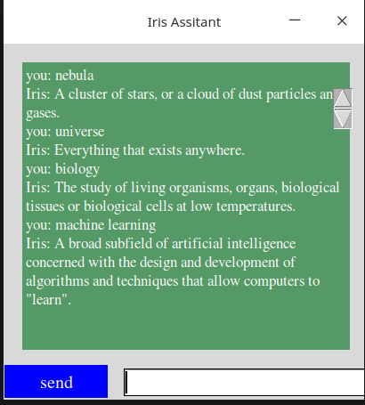

This a cross-platform desktop app built with [tkinter] which simply acts like a dictionary chatbot, you can send it a message and it will return a response on what it thinks the message is by fetching it in a very large dictionary.

## Getting started

To get started with this app, you might have to clone or download the repository first;


```


## launching

Now once installed launch it by running as you would run a normal python script and the gui for chatbot will pop up;

```bash
python app.py
```

### launched interface

Your interface for the chatbot app will probably look like shown below;


